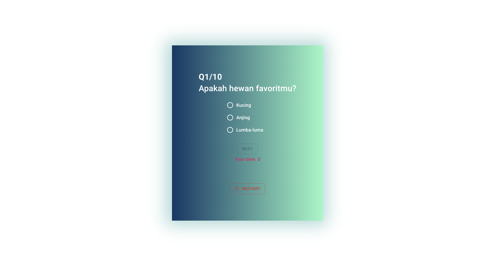

# SURVEY APP REACT

> Live Demo :)
**[Visit Project](https://survey-app-react-wikiakai.netlify.app/)**

## Quick Start

- Clone the repo: `git clone https://github.com/wikiakai/survey-app-react.git`
- open terminal, enter`cd survey-app-react`
- Install dependencies: `npm install` or `yarn`
- Start the server: `npm run dev` or `yarn run dev`
- Views are on: `localhost:3000`

## Tech Stack
- React : 18.2.0
- Material UI : 5.11.0
- react-router-dom: 6.8.1
